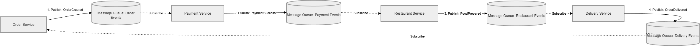
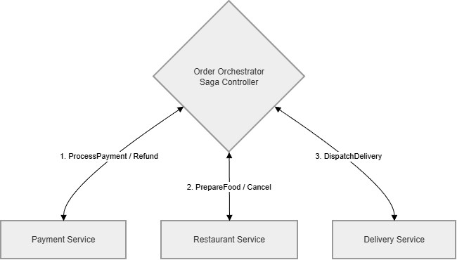

# Buổi 5: Event Chorenography and Orchestration

## 1. Giới thiệu sơ lược
### a. Event Choreography
- Bản chất: Giống như một ban nhạc có Nhạc trưởng đứng giữa chỉ huy. Vị nhạc trưởng này sẽ chỉ đạo người này chơi kèn, người kia đánh trống theo một kịch bản đã định sẵn.

- Cách hoạt động: Có một service trung tâm (gọi là Orchestrator) đóng vai trò bộ não điều phối. Nó gửi "Lệnh" (Command) yêu cầu các service khác làm việc, đợi báo cáo kết quả trả về, rồi quyết định bước tiếp theo phải làm gì.

- Ưu điểm: Có người "nắm đằng chuôi" nên rất dễ theo dõi toàn bộ quy trình. Việc xử lý các lỗi phức tạp (ví dụ: giao hàng thất bại thì phải chạy quy trình hoàn tiền, hủy món) diễn ra rất tập trung và an toàn.

- Nhược điểm: Service trung tâm (Orchestrator) phải ôm đồm nhiều việc, nếu nó chết hoặc bị quá tải, cả hệ thống sẽ đứng im. Các service phụ thuộc chặt chẽ vào Orchestrator.

### b. Event Orchestration
- Bản chất: Giống như một đội múa hoặc trò chơi chạy tiếp sức. Không ai chỉ huy ai cả. Khi người A chạy đến nơi và trao gậy, người B sẽ tự động chạy tiếp.

- Cách hoạt động: Không có trung tâm điều khiển nào cả. Các service làm việc hoàn toàn độc lập. Khi hoàn thành công việc của mình, service sẽ "phát loa" thông báo một Sự kiện (Event) ra bên ngoài (thông qua hệ thống Message Queue như Kafka/RabbitMQ). Các service khác cứ chầu chực nghe ngóng, thấy sự kiện liên quan đến mình thì tự động nhảy vào làm.

- Ưu điểm: Rất linh hoạt, các service hoàn toàn không biết đến sự tồn tại của nhau (độ khớp nối lỏng lẻo). Bạn có thể thêm bao nhiêu service vào hệ thống cũng được mà không làm ảnh hưởng đến các service cũ. Hệ thống không có điểm mù chết người (Single Point of Failure).

- Nhược điểm: Khó theo dõi bức tranh tổng thể. Khi luồng hệ thống trở nên phức tạp với hàng chục service gọi nhau chéo ngoe, việc dò lỗi xem một giao dịch đang bị kẹt ở đâu sẽ cực kỳ đau đầu.

## 2. Workflow:

### a. Event Choreography:

 

**Giải thích luồng hoạt động (Mô hình chạy tiếp sức qua Message Queue):**
*Các service hoạt động độc lập, giao tiếp với nhau bằng cách "phát" (Publish) và "lắng nghe" (Subscribe) sự kiện thông qua các hàng đợi (Queue).*
1. **OrderCreated:** `Order Service` tiếp nhận đơn, phát sự kiện "Đã tạo đơn" lên Queue rồi kết thúc nhiệm vụ, không cần chờ đợi.
2. **PaymentSuccess:** `Payment Service` luôn túc trực "lắng nghe" Queue này. Thấy có đơn mới, nó nhận nhiệm vụ trừ tiền, lấy xong tiền lại phát tiếp sự kiện "Thanh toán thành công" sang Queue kế tiếp.
3. **FoodPrepared:** Tương tự, `Restaurant Service` nghe được tin đã thanh toán liền báo bếp làm món. Xong xuôi phát sự kiện "Đã làm món xong".
4. **OrderDelivered:** `Delivery Service` chầu chực lấy sự kiện từ bếp. Nhận được thì đem giao, giao xong cập nhật trạng thái trên hệ thống.
=> **Bản chất:** Chạy theo kiểu tiếp sức. Người trước hoàn thành thì "quăng" kết quả ra giữa sân (Queue), người sau nhận thấy tín hiệu của mình thì tự động nhặt lấy chạy tiếp, không ai ra lệnh cho ai.

### b. Event Orchestration:

**Giải thích luồng hoạt động (Mô hình Nhạc trưởng điều phối):**
*Có một bộ não trung tâm (`Order Orchestrator / Saga Controller`) nắm giữ toàn bộ kịch bản, làm nhiệm vụ "chỉ tay năm ngón" gọi lệnh (Command) tới từng service cụ thể.*
1. **Khởi tạo quy trình:** Khi có đơn hàng, Orchestrator được sinh ra để cầm trịch, đốc thúc toàn bộ quy trình của giao dịch này.
2. **Ra lệnh thanh toán:** Orchestrator gọi thẳng qua `Payment Service` ép trừ tiền và đứng đợi kết quả báo về.
3. **Ra lệnh nấu món:** Thanh toán OKE, Orchestrator lại "nhấc máy" gọi `Restaurant Service` yêu cầu nấu thức ăn.
4. **Ra lệnh giao hàng:** Báo nấu xong, Orchestrator tự tay giao việc cho `Delivery Service` xuất phát đi giao.
=> **Bản chất:** Các service con bên dưới (Payment, Restaurant, Delivery) hoàn toàn "mù tịt" không hề kết nối với nhau. Mọi tiến độ đều do Orchestrator kiểm soát. Điểm mạnh nhất là xử lý lỗi: Nếu Bước 3 (nấu món) gặp sự cố hết nguyên liệu, chính Orchestrator sẽ ra lệnh gọi ngược về Bước 2 để hoàn trả tiền cho khách hàng (Quá trình Rollback).

## 3. So sánh ưu nhược điểm:

| Tiêu chí | Event Choreography (Vũ đạo / Chạy tiếp sức) | Event Orchestration (Hòa tấu / Nhạc trưởng) |
|---|---|---|
| **Mô hình hoạt động** | Tự trị, giao tiếp thông qua các Sự kiện trên Message Queue (Event-Driven). | Tập trung, có một bộ điều phối (Orchestrator) phát lệnh (Command-Driven) tới từng service. |
| **Tính phụ thuộc (Coupling)** | **Lỏng lẻo (Loosely coupled):** Các service hoàn toàn không biết đến nhau. | **Chặt chẽ hơn:** Orchestrator bắt buộc phải biết rõ các service khác để ra lệnh. |
| **Ưu điểm** | - Dễ dàng mở rộng (thêm/bớt service không ảnh hưởng luồng cũ). - Không có điểm chết toàn cục (No Single Point of Failure). - Thực thi nhanh gọn. | - Rất dễ theo dõi, giám sát toàn bộ trạng thái của một quy trình. - Việc xử lý lỗi và đền bù (Rollback/Saga) được quản lý tập trung cực kỳ an toàn. |
| **Nhược điểm** | - Rất khó nắm bắt được toàn cảnh quy trình. - Dò tìm lỗi (trace bug) ác mộng khi hệ thống lớn. - Khó kiểm soát Rollback nếu có chuỗi lỗi liên hoàn. | - Orchestrator trở thành nút thắt cổ chai hoặc điểm chết (Single Point of Failure) nếu bị quá tải/sập. - Logic trung tâm phình to dễ khó bảo trì. |
| **Trường hợp khuyên dùng** | Các quy trình đơn giản, ít bước, cần tốc độ cực nhanh và mở rộng linh hoạt. | Các quy trình kinh doanh nghiệp vụ phức tạp (như thanh toán, e-commerce) cần tính chặt chẽ. |

## 4. Quyết định mô hình phù hợp với scaling + resilience:

Để tối ưu hóa mạnh mẽ nhất cho cả **Scaling (Khả năng mở rộng)** và **Resilience (Khả năng chịu lỗi/Phục hồi)**, mô hình **Event Choreography (Vũ đạo/Tiếp sức qua Queue)** sẽ là lựa chọn phù hợp nhất. 

**Lý do chi tiết:**

1. **Về Scaling (Mở rộng linh hoạt):**
   - **Không bị thắt cổ chai giới hạn:** Orchestrator (bộ điều phối trung tâm) thường dễ trở thành "bottleneck" khi phải xử lý chung hàng triệu luồng cùng lúc. Ngược lại, Choreography phân tán khối lượng công việc ra.
   - **Tự chủ Scale (Auto-scaling dễ dàng):** Vì giao tiếp bằng cách "Bắn" & "Nghe" thông điệp qua Message Queue (như Kafka/RabbitMQ), khi thấy hàng đợi `Payment Events` bị nghẽn do quá nhiều đơn, hệ thống có thể dễ dàng tạo thêm (Scale out) 10 instance của `Payment Service` cùng lúc lao vào xử lý Queue đó để giảm tải mà không làm ảnh hưởng đến các service khác.

2. **Về Resilience (Tính phục hồi tiến trình):**
   - **Không có Single Point of Failure (Không có điểm chết toàn cục):** Nếu `Order Orchestrator` bị sập mạng, toàn bộ chuỗi luồng dừng cứng lại. Với hệ thống phân tán Choreography, không có ai là chủ.
   - **Cơ chế chịu lỗi bằng Message Queue (Buffer):** Giả sử `Delivery Service` đột ngột bị crash (die). Các tin báo `FoodPrepared` vẫn được Message Queue lưu trữ an toàn. Ngay khi `Delivery Service` reboot và sống lại, nó sẽ lại lấy các tin nhắn tắc nghẽn đó ra giao tiếp như bình thường. Không một tiến trình nào bị thất thoát (Zero Data Loss).

> **💡 Lưu ý thực tế kiến trúc:** Mặc dù Choreography tuyệt vời cho Scale và Resilience gốc, nhưng trong các quy trình nghiệp vụ yêu cầu tính chính xác cao về tiền bạc (Rollback phức tạp), người ta thường áp dụng **Hybrid (Kết hợp)**: Sử dụng *Choreography* giữa các Component cốt lõi ở ngoài cùng để tối ưu luồng, và dùng *Orchestration* trong phạm vi hẹp nội bộ khi xử lý 1 Transaction lớn (Saga) cần an toàn tuyệt đối.

## So sánh SQL Native vs JPA/Hibernate

| Tiêu chí | Native SQL (JDBC / SQL thuần) | JPA / Hibernate (ORM) |
| :--- | :--- | :--- |
| **Bản chất** | Viết trực tiếp các câu lệnh SQL (SELECT, INSERT, UPDATE...) bằng ngôn ngữ của Database. | Ánh xạ dữ liệu từ Database sang các Object trong Java (Object-Relational Mapping). |
| **Tốc độ phát triển (Productivity)** | **Chậm**. Phải viết nhiều code lặp lại (boilerplate) để map dữ liệu từ `ResultSet` sang Object. | **Rất nhanh**. Cung cấp sẵn các hàm CRUD cơ bản, không cần viết lại các câu lệnh SQL lặp đi lặp lại. |
| **Hiệu suất (Performance)** | **Cao nhất**. Do lập trình viên tự tối ưu câu lệnh truy vấn và không có độ trễ (overhead) từ framework. | **Thấp hơn một chút**. Có overhead do quá trình phân tích logic, mapping dữ liệu và tự động sinh SQL. |
| **Tính độc lập CSDL (Portability)** | **Thấp**. Truy vấn bị phụ thuộc chặt chẽ vào loại DB (MySQL, PostgreSQL, Oracle...). Đổi DB thường phải viết lại SQL. | **Rất cao**. Chỉ cần thay đổi cấu hình `Dialect`. Hibernate sẽ tự động dịch HQL/JPQL sang SQL chuẩn của DB đó. |
| **Khả năng bảo trì (Maintainability)** | **Khó**. Cấu trúc bảng thay đổi (đổi tên cột) đồng nghĩa với việc phải tìm và sửa các chuỗi SQL (String) rải rác trong code. | **Dễ dàng**. Khi DB thay đổi, chỉ cần cập nhật lại class Entity. Code hướng đối tượng (OOP) nên dễ refactor. |
| **Truy vấn phức tạp & Báo cáo** | **Mạnh mẽ & Linh hoạt**. Dễ dàng sử dụng các hàm đặc thù của DB (Window functions, CTE, tối ưu index sâu). | **Khó khăn**. Viết báo cáo phức tạp bằng JPQL/Criteria API rất cồng kềnh. Thường dễ sinh ra lỗi hiệu năng như **N+1 Query**. |
| **Bảo mật (Security)** | Nguy cơ dính **SQL Injection** cao nếu nối chuỗi (String concatenation) không cẩn thận (dù dùng `PreparedStatement` sẽ khắc phục được). | Chống SQL Injection tốt hơn do framework tự động xử lý và sử dụng tham số (parameterized queries) mặc định. |
| **Đường cong học tập (Learning Curve)** | **Thấp**. Chỉ cần nắm vững cú pháp SQL cơ bản. | **Cao**. Phải học thêm rất nhiều concept phức tạp: Entity Lifecycle (Transient, Persistent, Detached), L1/L2 Cache, Lazy/Eager Loading... |