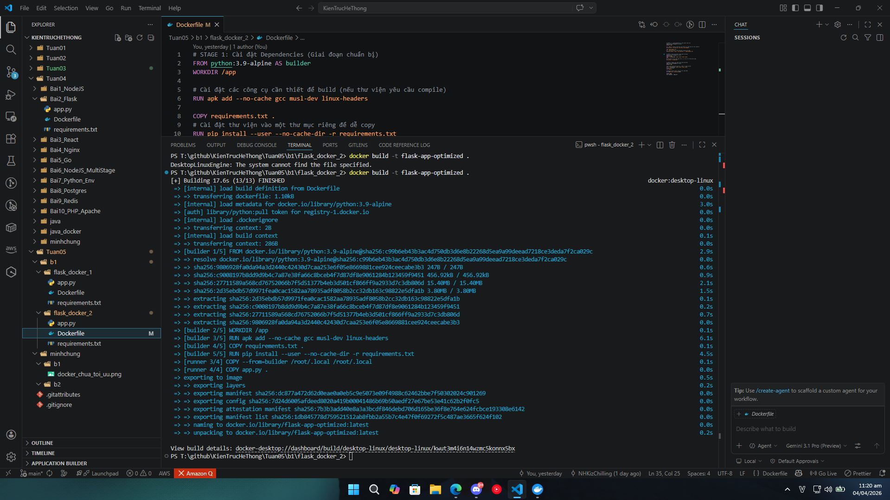
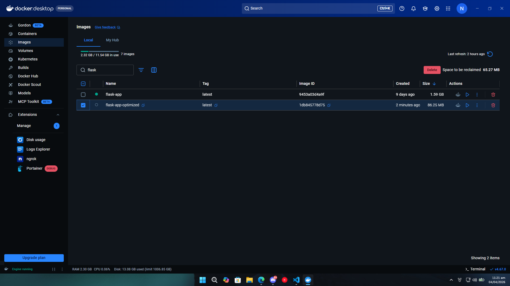
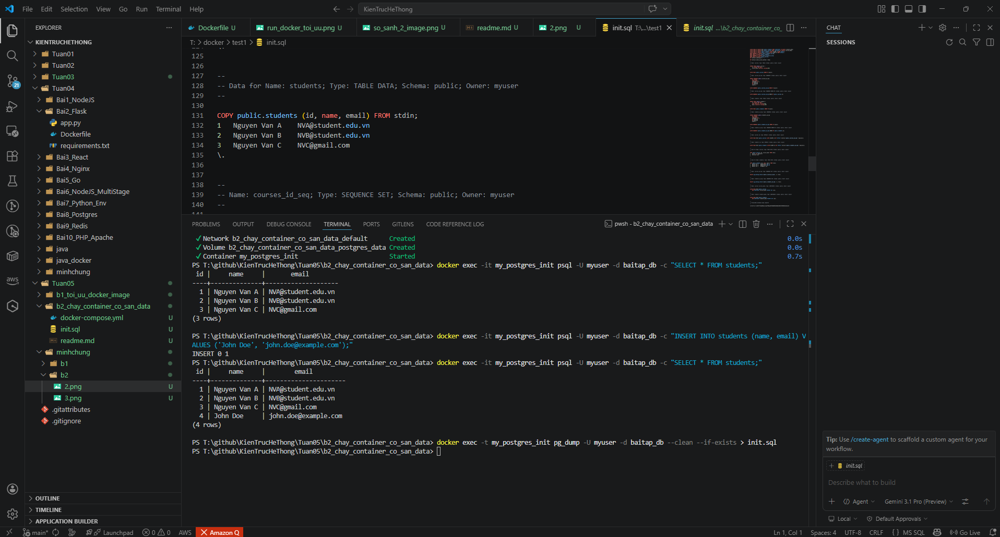
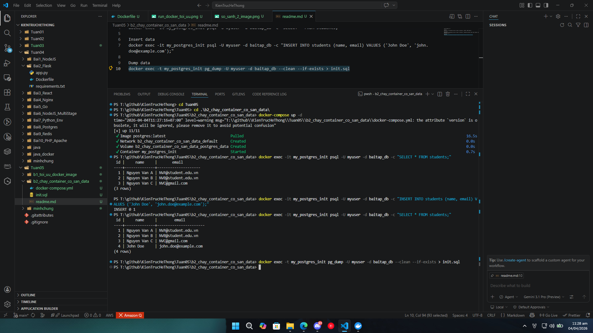
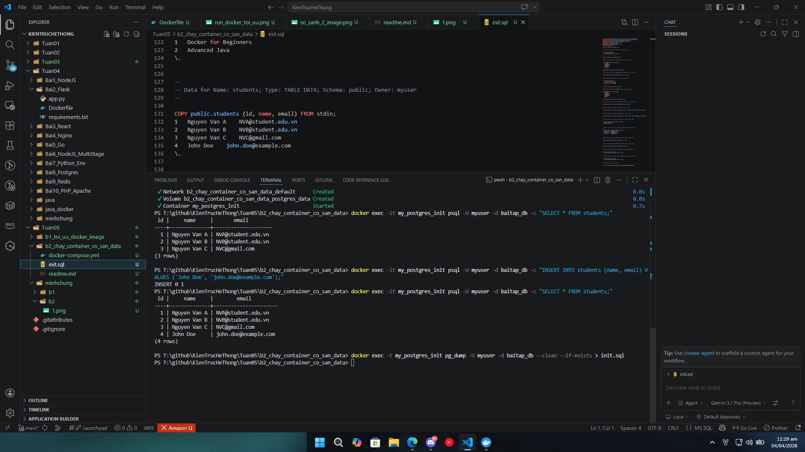
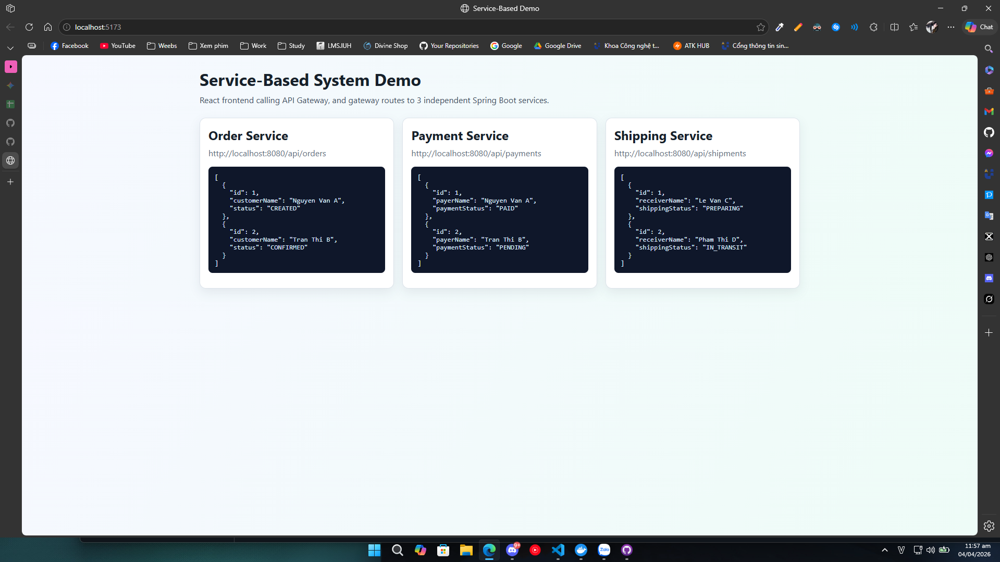
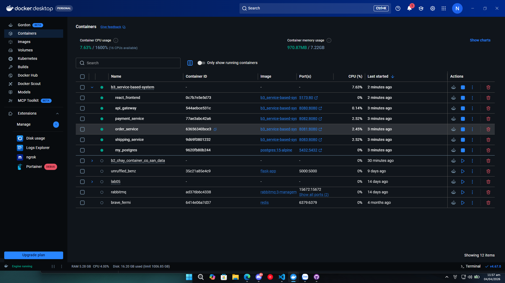

# Báo Cáo Thực Hành Lab 05
## Mục lục
- [Bài 1: Tối ưu Docker Image](#bài-1-tối-ưu-docker-image)
- [Bài 2: Chạy container có sẵn data (PostgreSQL)](#bài-2-chạy-container-có-sẵn-data-postgresql)
- [Bài 3: Service-based System Demo](#bài-3-service-based-system-demo)

---

## Bài 1: Tối ưu Docker Image

### 1. Hướng dẫn & Giải thích
- **Mục tiêu:** Mục lục bài 1 là tối ưu hóa kích thước (size) của Docker image cho một ứng dụng Python Flask bằng cách chọn base image phù hợp gọn nhẹ hơn là `python:3.9-alpine` cũng như áp dụng multi-stage build để giảm thiểu dung lượng dư thừa.
- Ở **`flask_docker_1`**, hệ thống dùng base image tiêu chuẩn (`python:3.9` hoặc phiên bản Debian/Ubuntu đầy đủ). Kết quả: Image sau khi build lên tới hơn **1.5 GB** do chứa toàn bộ hệ điều hành và các công cụ dành cho dev, dẫu rằng khi chạy ứng dụng không cần đến chúng.
- Ở **`flask_docker_2`**, hệ thống chuyển sang dùng phiên bản `alpine` - phiên bản Linux được rút gọn tối đa (nhưng vẫn có gcc và build essential hỗ trợ). Image được thiết kế nhẹ bằng cách copy riêng các file build xong mà không mang theo bộ cài đặt vào Runtime. Từ đó giảm bớt dung lượng khi deploy, push image nhanh hơn và an toàn về bảo mật.

### 2. So sánh
- **Image chưa tối ưu (`flask-app`):** Kích thước lên tới **1.59 GB**.
- **Image đã tối ưu (`flask-app-optimized`):** Kích thước chỉ **86.25 MB**.
- **Kết luận:** Phương pháp này giúp giảm được hơn ~94% dung lượng nhưng vẫn đảm bảo tính đúng đắn khi thực thi của ứng dụng.

### 3. Hình ảnh minh chứng
Image chưa tối ưu trên Docker Desktop


Chạy `Dockerfile` đã tối ưu trong folder `flask_docker_2`


Image đã tối ưu trên so với image chưa tối ưu trên Docker Desktop


---

## Bài 2: Chạy container có sẵn data (PostgreSQL)

### 1. Hướng dẫn & Giải thích
- **Mục tiêu:** Khởi chạy một PostgreSQL database container chuẩn bằng **Docker Compose** và map cho nó file cấu hình sẵn dữ liệu (seed data) ban đầu `init.sql`.
- **Cách hoạt động:**
  - File `docker-compose.yml` thiết lập dịch vụ `postgres` với các biến môi trường: User (`POSTGRES_USER`), Password (`POSTGRES_PASSWORD`) và Database mặc định (`POSTGRES_DB`).
  - Điểm mấu chốt là cách map volume: `./init.sql:/docker-entrypoint-initdb.d/init.sql`. Những script hoặc file SQL nào nằm trong thư mục `/docker-entrypoint-initdb.d/` sẽ được tự động chạy ở lần đầu container tạo schema, dễ dàng insert dữ liệu khởi tạo.

### 2. Các lệnh thao tác với Database
- Khởi động service ẩn dưới nền::
  ```bash
  docker-compose up -d
  ```
- Kết nối vào container để thực thi lệnh truy vấn (`SELECT`/`INSERT`):
  ```bash
  docker exec -it my_postgres_init psql -U myuser -d baitap_db -c "SELECT * FROM students;"
  docker exec -it my_postgres_init psql -U myuser -d baitap_db -c "INSERT INTO students (name, email) VALUES ('John Doe', 'john.doe@example.com');"
  ```
- Dễ dàng Dump (Backup) dữ liệu sau những cập nhật (tạo script `init.sql` mới từ bảng hiện tại) qua lệnh tiện ích `pg_dump`:
  ```bash
  docker exec -t my_postgres_init pg_dump -U myuser -d baitap_db --clean --if-exists > init.sql
  ```

### 3. Hình ảnh minh chứng
Data ban đầu
 

Thao tác SQL trong container
 

Data sau khi dump lại vào `init.sql` (đã có thêm dòng mới sau khi insert)


---

## Bài 3: Service-based System Demo

### 1. Hướng dẫn & Giải thích
- **Kiến trúc:** Đây là hệ thống Demo theo kiến trúc hướng dịch vụ (Service-based):
  - **Backend Services:** Gồm 3 service độc lập chạy song song, phân tác nhiệm vụ (viết bằng Spring Boot): `order-service` (cổng 8081), `payment-service` (8082), `shipping-service` (8083).
  - **API Gateway:** `api-gateway` (Spring Cloud Gateway mở port 8080) đứng ra tiếp nhận một request từ Client (như ReactJS) và định tuyến (route) proxy ngầm vào đúng tên miền cho 3 service nhỏ, che giấu các backend kia đi.
  - **Frontend:** `frontend` thiết kế bằng React + Vite + Nginx, chạy qua cổng 5173.
  - **Database:** Chia sẻ chung 1 database PostgreSQL (`my_shared_db`) cho tất cả các service (mỗi service tự quản lý bảng dữ liệu cấu hình trong file `data.sql` riêng lẻ của mình).

### 2. Các Mode Profile Docker-Compose Khởi Chạy
- **Khởi động toàn bộ (`--build` ép build code mới):**
  ```bash
  docker compose up --build
  ```
- **Chạy Mode tốc độ (`docker-compose.fast.yml`):**
  - Mất Healthcheck rườm rà. Dành cho máy mạnh (thường start các service luôn không cần đợi Database fully up hoàn toàn).
  ```bash
  docker compose -f docker-compose.yml -f docker-compose.fast.yml up --build
  ```
- **Chạy Mode an toàn (`docker-compose.safe.yml`):**
  - Chờ từng phần ưu tiên và healthcheck theo pipeline độ phụ thuộc. Frontend đợi Gateway, Gateway đợi Service, Service đợi DB. Ít phát sinh lỗi không kết nối được trên máy cấu hình yếu.
  ```bash
  docker compose -f docker-compose.yml -f docker-compose.safe.yml up --build
  ```

### 3. Hình ảnh minh chứng
 


